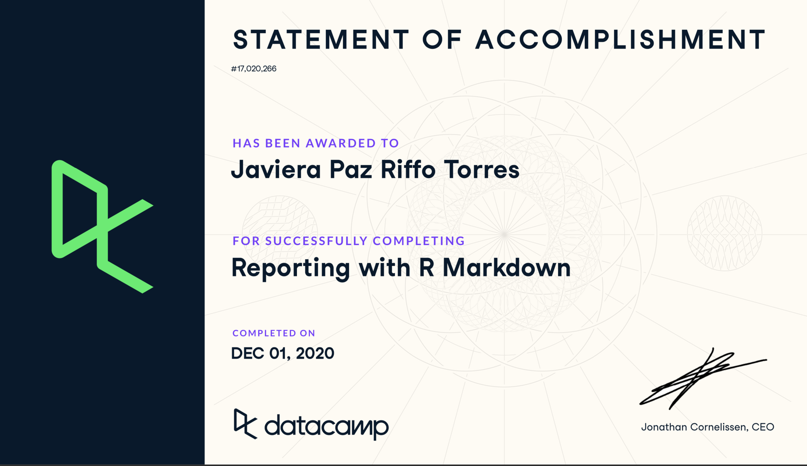
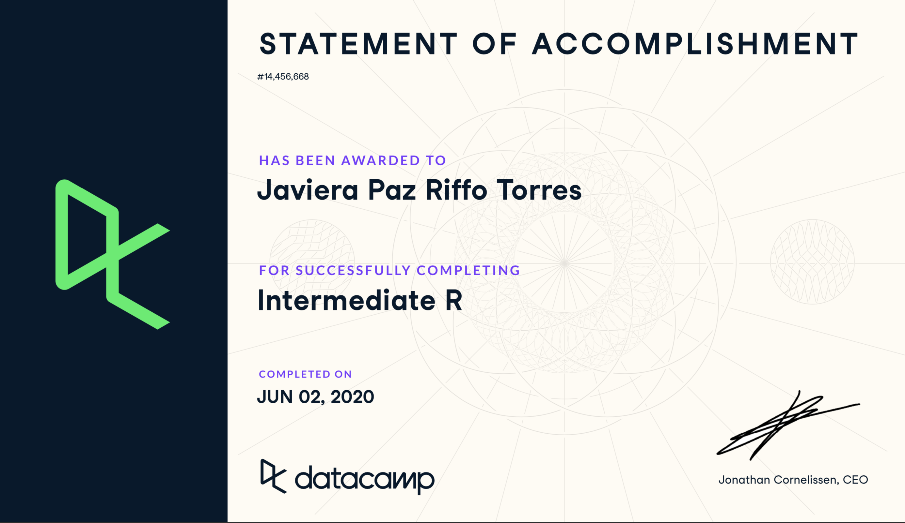
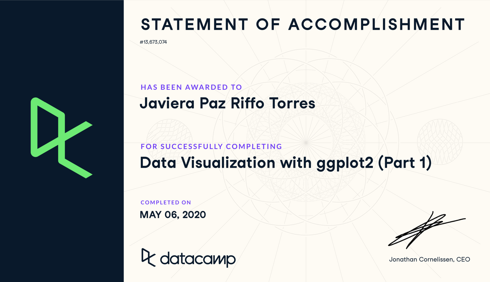
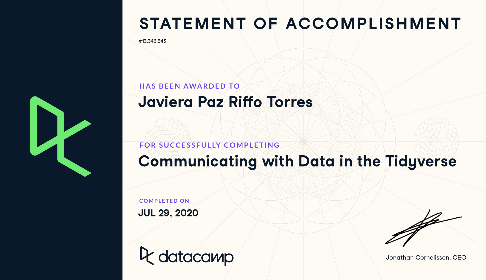
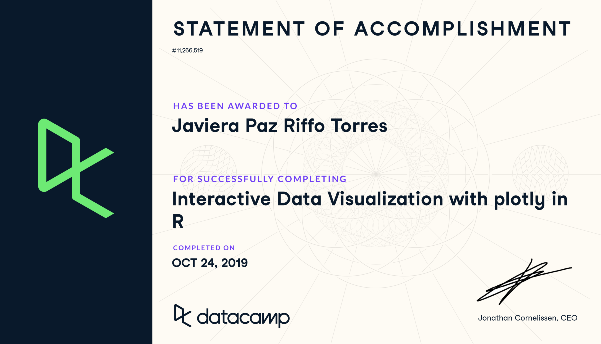
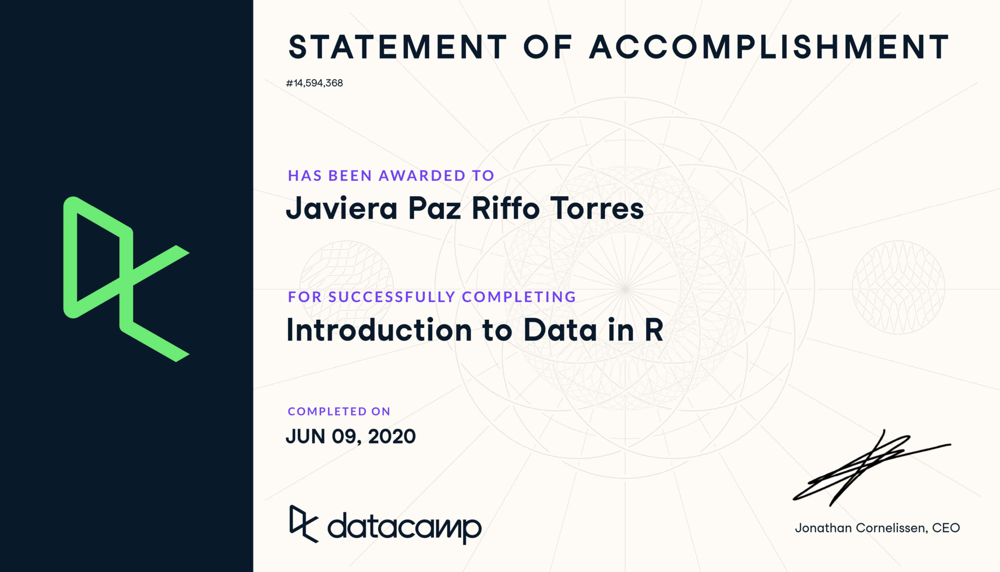
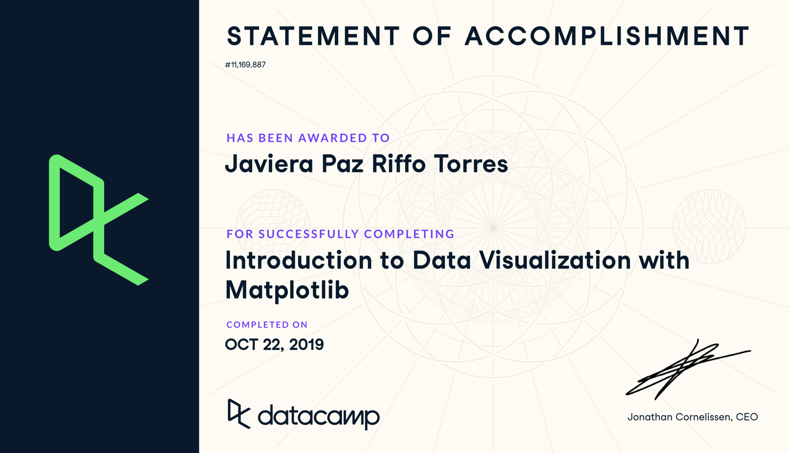
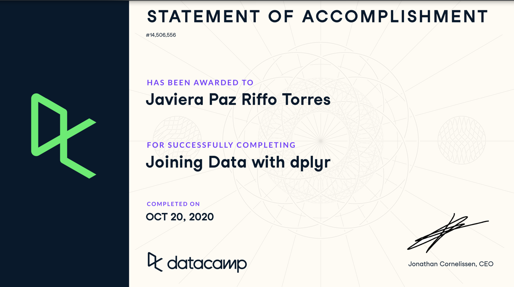
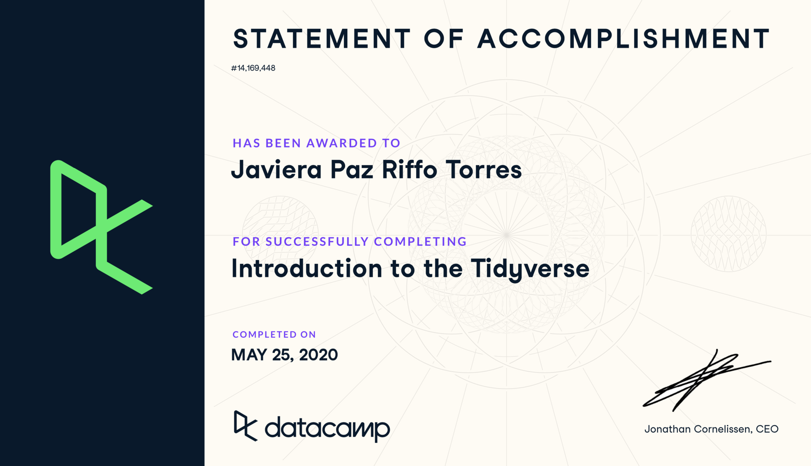

# datacamp_certificate

## Reporting with R Markdown

## Intermediate R

## Data Visualization with ggplot2 part1

## Communicating with Data in the Tidyverse

## Interactive Visualization with ggplotly in R

## Data Visualization with ggplot2 part2

![] (certificate-Data_Visualization_with_ggplot2_part2.png)

## Introduction to Data in R

## Introduction to Data Visualization with Matplotlin

## Joining Data with dplyr

## Introduction to Tidyverse

